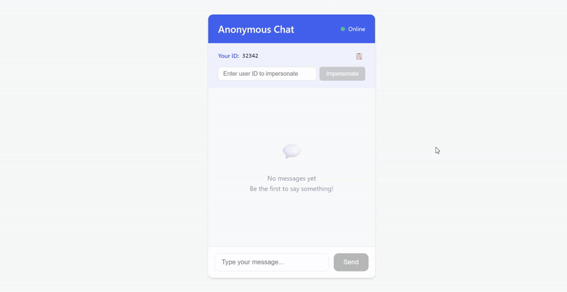

# Анонимный чат

## Установка после клонирования репозитория

### backend
```
cd chat-anonim
cd backend
npm install
npm start
```

### frontend
```
cd chat-anonim
cd frontend
npm install
npm run dev
```

## Деплой


Ссылка на публичную страницу: .vercel.app

